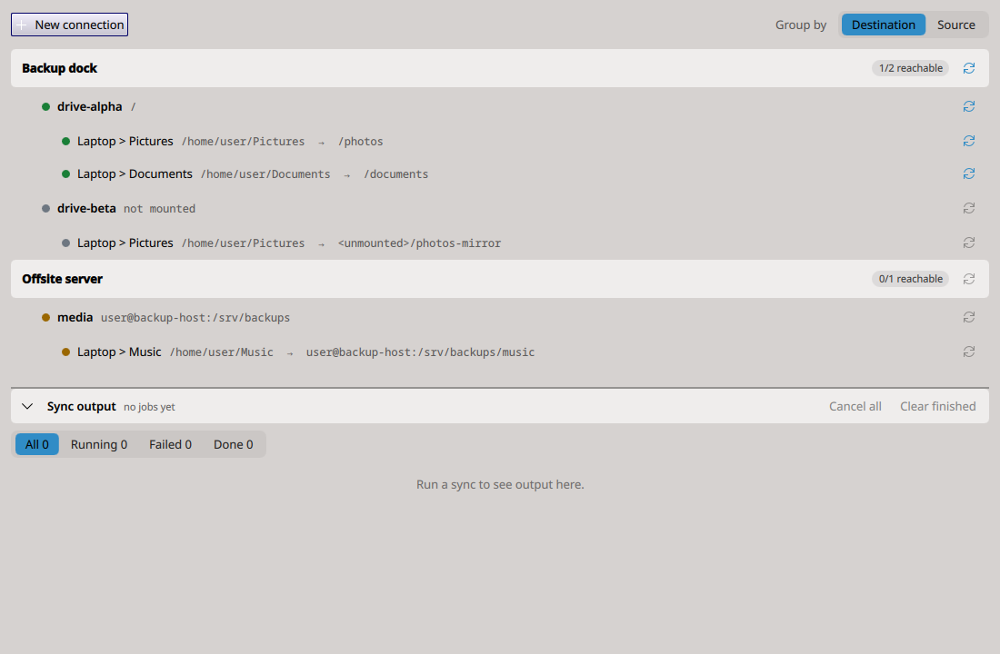

# WeRsyncing

A KDE desktop app that replaces hand-typed `rsync` invocations with a managed
library of connections. Define *source folder → destination device* pairs once,
then run them with one click — the app always shows you the literal `rsync`
command it is about to execute.



## What it does

- **One page.** A tree of your sync connections, groupable by destination or
  by source. No tabs, no wizards.
- **Mount-aware.** Local backup drives are tracked by filesystem UUID and
  polled via `lsblk`; SSH remotes are probed on their SSH port. Unreachable
  destinations are shown as such, and their sync buttons disable themselves.
- **Scoped syncs.** Run a single connection, everything on one device
  (sequential — one writer per disk), or a whole container of devices
  (parallel across devices, sequential within each).
- **Pre-flight checks.** Before anything runs: source exists and is readable,
  destination is actually mounted, `--delete` and other risky options require
  an explicit per-run acknowledgement.
- **The command is the interface.** Every confirmation dialog and output panel
  shows the exact shell-quoted `rsync` argv. Copy it, inspect it, distrust it.
- **Live output.** Streaming per-job output panel, system tray with progress
  tooltip, desktop notifications on completion, sleep inhibition while
  syncing.
- **rsync options as data.** Long-form flags (`--archive`, not `-a`) with
  per-connection defaults and per-run overrides. Structured `--chown`/`--chmod`
  support for NAS-style destinations, excludes, custom `--rsh`.

## Install (Fedora)

Download the latest `.rpm` from
[Releases](https://github.com/jmoraur/wersyncing/releases), then:

```bash
sudo dnf install ./wersyncing-*.noarch.rpm
```

Launch **WeRsyncing** from the app menu / KRunner, or run `wersyncing`
in a terminal.

Dependencies (pulled in automatically): `python3-pyside6`, `rsync`.

## Run from source

```bash
git clone https://github.com/jmoraur/wersyncing.git
cd wersyncing
sudo dnf install python3-pyside6 rsync
python -m rsync_app
```

Optional: `bash scripts/install_desktop.sh` adds a launcher entry that runs
the app from the checkout.

## Data locations

- Connection library (SQLite): `~/.local/share/RsyncApp/RsyncApp/rsync.db`
- Window/UI settings: `~/.config/RsyncApp/RsyncApp.conf`

Delete either file to reset.

## Scope and non-goals

Built for a single user on Fedora KDE. Local USB disks and rsync-over-SSH
remotes only — no SSHFS/NFS/CIFS mount management, no scheduling daemon, no
sync history database. The app manages and runs commands; your data is only
ever touched by plain `rsync`.

## License

[PolyForm Noncommercial 1.0.0](LICENSE) — free for personal and other
noncommercial use, forks welcome; commercial use is not permitted.
